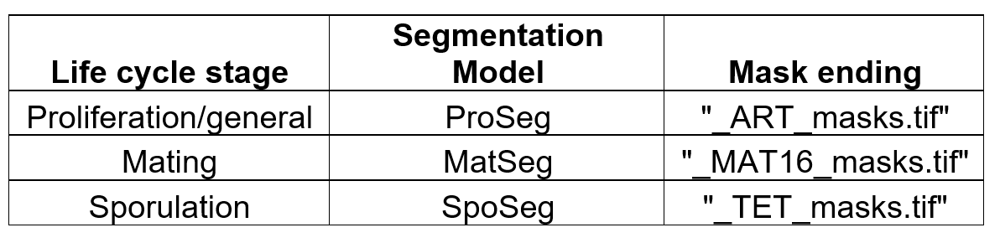

# Life_Cycle_Tracking
Source Code for the FIEST tracking algorithm

This code contains the tracking algorithms used after image interpolation to fully track cells throughout the life cycle of the mode eukaryote S. cerevisiae. 
It requires a folder containing the segmentations obtained from each life cycle stage-specific models. 
The toydata set “Pos13_1_B” (also in this repository) contains a representative time series with cells undergoing a full life cycle (sporulation, germination, mating, proliferation). The masks have endings according to the segmentation model, in this example: 

Noticed that for images without a detection masks are not saved to save memory. The code will extract the correct mask number by looking into the file name which has the following standardize structure: “img_000000000_Ph3_00”, where the nine zeros between the underscores can be changed to represent the current time points in the time series. For instance, image 717 will be: “img_000000717_Ph3_000”
The tracking of all life cycle stages is done in the following steps: 

1. Tracking of sporulating cells using the "_TET_masks.tif” masks; lines 76 - 343. The sporulated cells might produce discontinuous tracks initially (cell masks might be missing in some time points), but the tracking code completes the missing detections by using the existing detections to produce continuous tracks. Notice in this toy data set we have a “shock period”, which represents a harsh treatment of LiCl/Nystatin for the cells, which do not move or grow during this step, therefore those time points are skipped for speed. 
To visualize the tracks, use plt.imshow() in lines 259 and 325 to visualize the initial discontinuous tracks (all_obj) and the final reconstituted tracks (TET_Size). 

 
2. The tracked TETmasks are inserted into the general detection by ProSeg in lines 350 - 476. This is required because the model for detection of sporulated cells (SpoSeg) produces more accurate masks than the model for general detection of yeast cells (ProSeg). The resulting masks are a combination of ProSeg + SpoSeg and are contained in the Art_MT variable. 
Each one of the steps can be visualize using the commented plt.imshow() distributed across the code every time a mask is modified. 

3. Tracking of all cells using masks contained in the Art_MT variable in lines 498 - 948. All cells in the Art_MT are tracked based on the cell mask overlap between two consecutive frames. Each cell is superimpose on the next segmented image mask and the cell mask with the highest overlap is assigned as the same cell in the next image. The process is repeated until all cells, including newborns, are tracked. The code includes corrections in case small segmentation artifacts are present and contains relabeling steps to ensure the cells indexes go from 1 to n.  The fully tracked masks are stored in the Mask7 variable and the size of the tracked cells can be visualized by plt.imshow() the Art_all_ob variable. 
Each one of the steps can be visualize using the commented plt.imshow() distributed across the code every time a mask is modified. 

4. Tracking of mating events (cells that fused through mating) using the "_MAT16_masks.tif”  masks; lines 958 - 1197. The mating cells might produce discontinuous tracks initially (cell masks might be missing in some time points), but the tracking code completes the missing detections by using the existing detections to produce continuous tracks. Notice in this toy data set we have a “shock period”, which represents a harsh treatment of LiCl/Nystatin for the cells, which do not move or grow during this step, therefore those time points are skipped for speed. The final tracked mating masks are store in the variable Matmasks.

5. Tracking of mating events (cells that fused through mating) using the "_MAT16_masks.tif”  masks; lines 958 - 1197. The mating cells might produce discontinuous tracks initially (cell masks might be missing in some time points), but the tracking code completes the missing detections by using the existing detections to produce continuous tracks. Notice in this toy data set we have a “shock period”, which represents a harsh treatment of LiCl/Nystatin for the cells, which do not move or grow during this step, therefore those time points are skipped for speed. The final tracked mating masks are store in the variable Matmasks.

6. The tracked Matmasks are improved by the general detection model ProSeg in lines 1209 - 1401. This is required because the morphological variation of mating events is better capture by fusing the information from masks in the mating cell masks derived from (MatSeg) with the cell masks from the general detection with ProSeg. The resulting Matmasks are a combination of ProSeg + MatSeg and are contained in the Matmasks variable. 
Each one of the steps can be visualize using the commented plt.imshow() distributed across the code every time a mask is modified. Use plt.imshow() in line 1393 to visualize the final reconstituted tracks (all_obj). 

7. Removing the mating events from the general tracks stored in Mask7. This is necessary because once two cells mate, the indexes of previous mating haploids should be removed. This finishes the full life cycle tracking tracking producing two three sets of tracked masks: TETmasks containing the sporulating cells tracks, Matmasks containing the mating cells tracks, and Mask7 containing the tracks for all cells that are not mating. 

